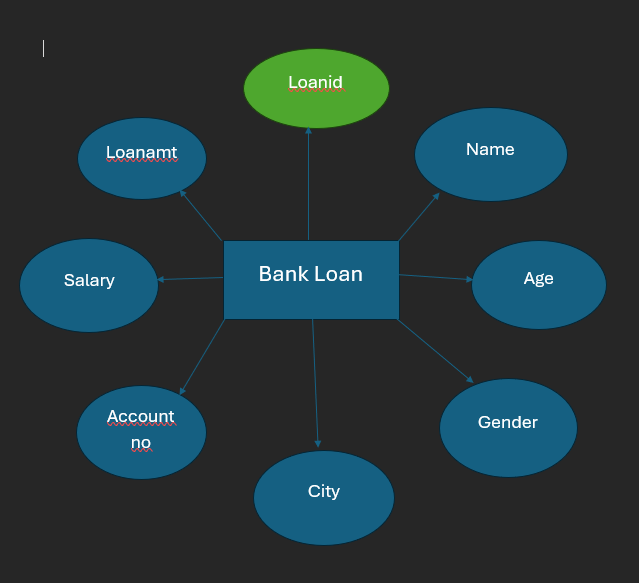

# Ex02 Django ORM Web Application
## Date: 11.09.2024

## AIM
To develop a Django application to store and retrieve data from a bank loan database using Object Relational Mapping(ORM).

## ENTITY RELATIONSHIP DIAGRAM


## DESIGN STEPS

### STEP 1:
Clone the problem from GitHub

### STEP 2:
Create a new app in Django project

### STEP 3:
Enter the code for admin.py and models.py

### STEP 4:
Execute Django admin and create details for 10 books

## PROGRAM
### admin.py
```python
from django.contrib import admin
from .models import Bankloan,BankloanAdmin
admin.site.register(Bankloan,BankloanAdmin)
```
### models.py
```python
from django.db import models
from django.contrib import admin
class Bankloan (models.Model):
    Loanid=models.IntegerField(primary_key=True);
    Name=models.CharField(max_length=100);
    Age=models.IntegerField(default=18);
    Gender=models.CharField(max_length=1, default='M');
    City=models.CharField(max_length=20, default='Chennai');
    Accountno=models.IntegerField();
    Salary=models.IntegerField();
    Loanamt=models.IntegerField();

class BankloanAdmin(admin.ModelAdmin):
    list_display=('Loanid','Name','Age','Gender','City','Accountno','Salary','Loanamt')
```

## OUTPUT


## RESULT
Thus the program for creating a database using ORM hass been executed successfully
